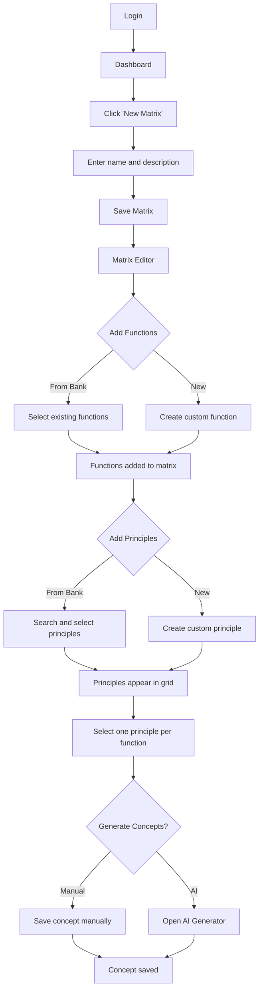
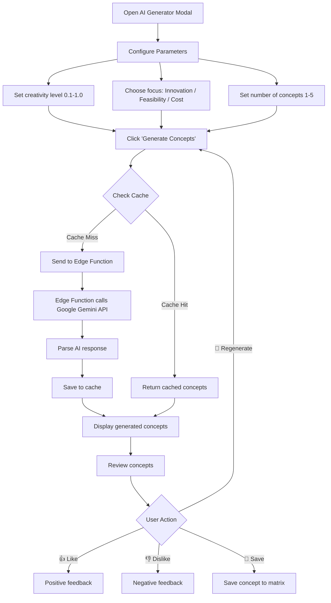
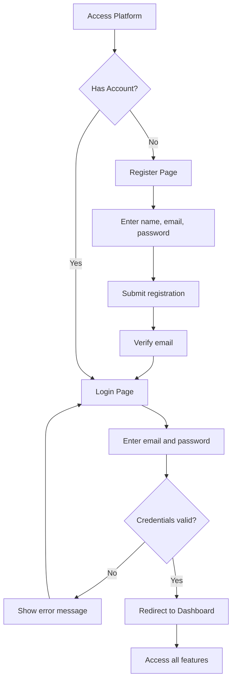
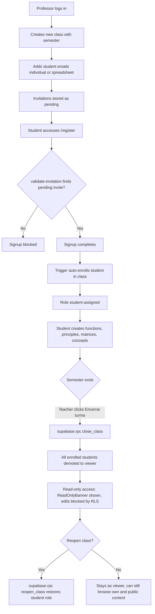
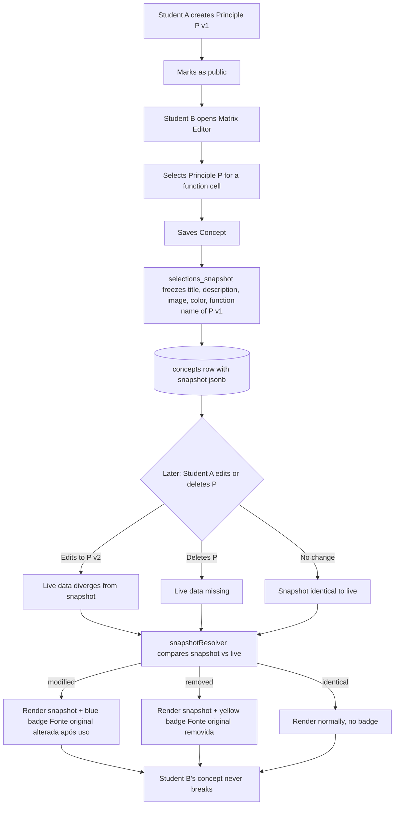
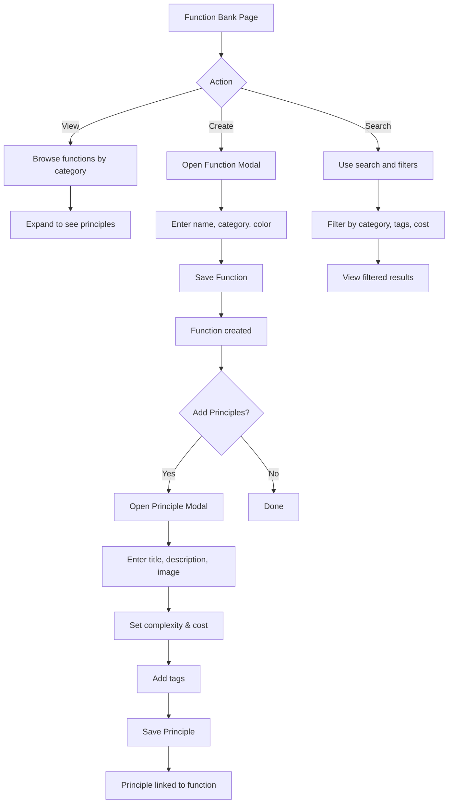

# MorphoDesign Platform (Morpho Canvas)

An educational web platform for product design students and professors to create, manage, and analyze **morphological matrices**. The system modernizes legacy workflows with an interactive interface focused on academic usability.


## 📋 Table of Contents

- [About the Project](#-about-the-project)
- [Features](#-features)
- [Technologies Used](#-technologies-used)
- [Architecture](#-architecture)
- [Installation](#-installation)
- [Folder Structure](#-folder-structure)
- [Database](#-database)
- [AI Concept Generation](#-ai-concept-generation)
- [Contributing](#-contributing)

## 🎯 About the Project

### What is a Morphological Matrix?

A **morphological matrix** is a creativity and problem-solving technique developed by Fritz Zwicky. It allows for systematically exploring all possible solution combinations for a design problem by organizing:

- **Functions**: The problems or requirements that need to be solved
- **Solution Principles**: The different ways to solve each function

### Platform Objective

MorphoDesign Platform was developed to:

1. **Digitize** the morphological matrix creation process
2. **Facilitate** collaboration between students and professors
3. **Automate** concept generation using Artificial Intelligence
4. **Organize** reusable function and principle databases
5. **Evaluate** concepts with cost, complexity, and feasibility metrics

## ✨ Features

### 🔐 Authentication
- Email-based login and registration
- Role system (admin, teacher, student)
- Customizable user profiles

### 📊 Dashboard
- Overview of created matrices
- Quick access to saved concepts
- Usage statistics

### 🗂️ Function Bank
- Catalog of functions organized by category:
  - Mechanical
  - Electrical
  - Thermal
  - Hydraulic
  - Chemical
  - Other
- Public (system) and private (user) functions
- Advanced search and filters

### 🧩 Solution Principles
- Principles linked to each function
- Illustrative images
- Complexity and cost metrics
- Tags for organization
- Intelligent search system

### 📐 Morphological Matrices
- Visual matrix creation
- Function and principle selection
- Drag-and-drop organization
- Data export

### 🤖 AI Concept Generation
- Integration with Google Gemini 1.5 Flash
- Configurable parameters:
  - Creativity level
  - Focus (innovation, feasibility, cost)
  - Number of concepts
- Cache system for optimization
- Detailed scoring and justification
- User feedback collection

### 💾 Concepts
- Save generated combinations
- Manual or AI tagging
- Concept history per matrix

## 🛠️ Technologies Used

### Frontend

| Technology | Version | Description |
|------------|---------|-------------|
| **React** | 18.3 | UI library |
| **TypeScript** | 5.x | Typed JavaScript superset |
| **Vite** | 5.x | Fast build tool and dev server |
| **Tailwind CSS** | 3.4 | Utility-first CSS framework |
| **shadcn/ui** | - | Accessible UI components |
| **React Router** | 6.x | Client-side routing |
| **React Query** | 5.x | Server state management |
| **Zustand** | 5.x | Global state management |
| **React Hook Form** | 7.x | Performant forms |
| **Zod** | 3.x | Schema validation |
| **Lucide React** | - | Icon library |
| **Recharts** | 2.x | Charts and visualizations |
| **Sonner** | 1.x | Toast notifications |

### Backend (Supabase/Lovable Cloud)

| Technology | Description |
|------------|-------------|
| **PostgreSQL** | Relational database |
| **Supabase Auth** | Authentication and authorization |
| **Supabase Storage** | File storage |
| **Edge Functions** | Serverless functions (Deno) |
| **Row Level Security** | Row-level security |

### Artificial Intelligence

| Technology | Description |
|------------|-------------|
| **Google Gemini 1.5 Flash** | Language model for concept generation |

## 🔄 User Flows

### Creating a Morphological Matrix



### AI Concept Generation Flow



### User Registration and Authentication



### Class Lifecycle (Teacher → Student → Viewer)



### Snapshot Preservation Flow (Cross-student durability)



### Function and Principle Management



## 🏗️ Architecture

```
┌─────────────────────────────────────────────────────────────┐
│                        Frontend                              │
│  ┌─────────┐  ┌─────────┐  ┌─────────┐  ┌─────────────────┐ │
│  │  React  │  │ Router  │  │  Query  │  │  Zustand Store  │ │
│  └────┬────┘  └────┬────┘  └────┬────┘  └────────┬────────┘ │
│       │            │            │                 │          │
│       └────────────┴────────────┴─────────────────┘          │
│                            │                                 │
└────────────────────────────┼─────────────────────────────────┘
                             │
                    ┌────────▼────────┐
                    │  Supabase SDK   │
                    └────────┬────────┘
                             │
┌────────────────────────────┼─────────────────────────────────┐
│                      Backend (Supabase)                      │
│  ┌─────────┐  ┌─────────┐  ┌─────────┐  ┌─────────────────┐ │
│  │  Auth   │  │PostgreSQL│  │ Storage │  │ Edge Functions  │ │
│  └─────────┘  └─────────┘  └─────────┘  └────────┬────────┘ │
│                                                   │          │
└───────────────────────────────────────────────────┼──────────┘
                                                    │
                                           ┌────────▼────────┐
                                           │  Google Gemini  │
                                           │     API         │
                                           └─────────────────┘
```

## 🚀 Installation

### Prerequisites

- **Node.js** 18+ 
- **npm** or **bun**
- [Lovable](https://lovable.dev) account (for backend)

### Local Installation

1. **Clone the repository**
```bash
git clone <REPOSITORY_URL>
cd morpho-canvas
```

2. **Install dependencies**
```bash
npm install
# or
bun install
```

3. **Configure environment variables**

The project uses Lovable Cloud, which automatically configures:
- `VITE_SUPABASE_URL`
- `VITE_SUPABASE_PUBLISHABLE_KEY`
- `VITE_SUPABASE_PROJECT_ID`

For AI concept generation, configure:
- `GOOGLE_GENERATIVE_AI_API_KEY` (in project secrets)

4. **Start development server**
```bash
npm run dev
# or
bun run dev
```

5. **Access the application**
```
http://localhost:5173
```

## 📁 Folder Structure

```
morpho-canvas/
├── public/                    # Static files
│   ├── favicon.ico
│   ├── placeholder.svg
│   └── robots.txt
├── src/
│   ├── components/            # React components
│   │   ├── layout/           # Layout components
│   │   │   ├── AppSidebar.tsx
│   │   │   └── DashboardLayout.tsx
│   │   ├── modals/           # Application modals
│   │   │   ├── AIConceptGeneratorModal.tsx
│   │   │   ├── ConceptSaveModal.tsx
│   │   │   ├── FunctionModal.tsx
│   │   │   ├── PrincipleModal.tsx
│   │   │   └── PrincipleSearchModal.tsx
│   │   └── ui/               # shadcn/ui components
│   ├── hooks/                # Custom hooks
│   │   ├── useAuth.tsx       # Authentication
│   │   ├── useConcepts.ts    # Concepts CRUD
│   │   ├── useFunctions.ts   # Functions CRUD
│   │   ├── useMatrices.ts    # Matrices CRUD
│   │   ├── usePrinciples.ts  # Principles CRUD
│   │   ├── useImageUpload.ts # Image upload
│   │   └── useAIConceptGeneration.ts
│   ├── integrations/         # External integrations
│   │   └── supabase/
│   │       ├── client.ts     # Supabase client
│   │       └── types.ts      # Database types
│   ├── pages/                # Application pages
│   │   ├── Index.tsx         # Landing page
│   │   ├── Login.tsx         # Login page
│   │   ├── Register.tsx      # Registration page
│   │   ├── Dashboard.tsx     # Main dashboard
│   │   ├── Matrices.tsx      # Matrix list
│   │   ├── MatrixEditor.tsx  # Matrix editor
│   │   ├── Concepts.tsx      # Saved concepts
│   │   ├── FunctionsBank.tsx # Function bank
│   │   ├── Settings.tsx      # Settings
│   │   └── NotFound.tsx      # 404 page
│   ├── store/                # Global state (Zustand)
│   │   └── morphoStore.ts
│   ├── types/                # Type definitions
│   │   └── morpho.ts
│   ├── lib/                  # Utilities
│   │   └── utils.ts
│   ├── App.tsx               # Root component
│   ├── main.tsx              # Entry point
│   └── index.css             # Global styles and design tokens
├── supabase/
│   ├── config.toml           # Supabase configuration
│   ├── functions/            # Edge Functions
│   │   └── generate-concepts/
│   │       └── index.ts      # AI concept generation
│   └── migrations/           # Database migrations
├── tailwind.config.ts        # Tailwind configuration
├── vite.config.ts            # Vite configuration
├── tsconfig.json             # TypeScript configuration
└── package.json              # Dependencies
```

## 🗄️ Database

### ER Diagram

```
┌─────────────────┐     ┌─────────────────┐     ┌─────────────────┐
│    profiles     │     │    functions    │     │   principles    │
├─────────────────┤     ├─────────────────┤     ├─────────────────┤
│ id (PK)         │     │ id (PK)         │◄────│ function_id(FK) │
│ user_id         │     │ name            │     │ id (PK)         │
│ name            │     │ description     │     │ title           │
│ email           │     │ category        │     │ description     │
│ avatar_url      │     │ color           │     │ image_url       │
│ created_at      │     │ is_public       │     │ complexity      │
│ updated_at      │     │ created_by      │     │ cost            │
└─────────────────┘     │ created_at      │     │ tags            │
                        │ updated_at      │     │ is_public       │
┌─────────────────┐     └─────────────────┘     │ created_by      │
│   user_roles    │                             │ usage_count     │
├─────────────────┤                             │ created_at      │
│ id (PK)         │                             │ updated_at      │
│ user_id         │                             └─────────────────┘
│ role            │
└─────────────────┘     ┌─────────────────┐     ┌─────────────────┐
                        │    matrices     │     │    concepts     │
                        ├─────────────────┤     ├─────────────────┤
                        │ id (PK)         │◄────│ matrix_id (FK)  │
                        │ name            │     │ id (PK)         │
                        │ description     │     │ name            │
                        │ function_ids    │     │ description     │
                        │ user_id         │     │ selections      │
                        │ created_at      │     │ generated_by    │
                        │ updated_at      │     │ created_at      │
                        └─────────────────┘     └─────────────────┘

┌─────────────────────┐
│  ai_concept_cache   │
├─────────────────────┤
│ id (PK)             │
│ user_id             │
│ selections_hash     │
│ selections          │
│ options             │
│ concepts            │
│ created_at          │
│ expires_at          │
└─────────────────────┘
```

### Enums

| Enum | Values |
|------|--------|
| `app_role` | admin, teacher, student |
| `function_category` | Mechanical, Electrical, Thermal, Hydraulic, Chemical, Other |
| `cost_level` | Low, Medium, High |
| `concept_generated_by` | manual, ai |

### Row Level Security (RLS)

All tables have RLS policies for:
- Users can view public data (`is_public = true`)
- Users can view/edit their own data
- Administrators have full access

## 🤖 AI Concept Generation

### How It Works

1. **Input**: User selects principles in the morphological matrix
2. **Configuration**: Define parameters (creativity, focus, quantity)
3. **Processing**: Edge Function sends to Google Gemini
4. **Cache**: Results are cached by selection hash
5. **Output**: Concepts with name, description, score, and justification

### Parameters

| Parameter | Description | Values |
|-----------|-------------|--------|
| Creativity | Innovation level of responses | 0.1 - 1.0 |
| Focus | Generation priority | Innovation, Feasibility, Cost |
| Quantity | Number of concepts | 1 - 10 |

### Cache System

To optimize costs and performance, a cache system based on selection and configuration hashes prevents redundant calls to the Gemini API.

```typescript
// Hash generated from:
{
  selections: { functionId: principleId },
  options: { creativity, focus, count }
}
```

## 🤝 Contributing

1. Fork the project
2. Create a feature branch (`git checkout -b feature/new-feature`)
3. Commit your changes (`git commit -m 'Add new feature'`)
4. Push to the branch (`git push origin feature/new-feature`)
5. Open a Pull Request

## 📄 License

This project was developed for educational purposes.
